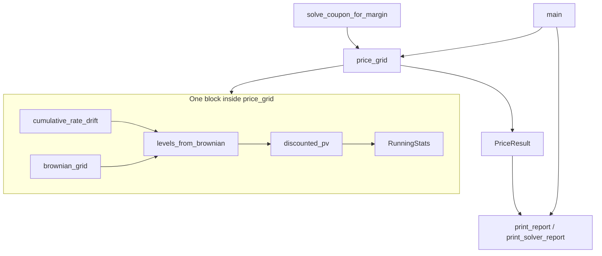

# Healthcare Phoenix Autocallable — Case Study

[](https://creativecommons.org/licenses/by-nc/4.0/)
[](PLAN.md)
[](https://typst.app/)

**Author:** [Alexandre Landi](https://www.linkedin.com/in/quantlandi/)

Take-home case study for advanced finance courses: price and launch a **Phoenix autocallable** on a **healthcare index** for EU retail, grounded in August 2026 financial press (FT Adviser + Les Echos Investir). Retail distributors sometimes label similar notes *Athena*; the case uses desk terminology throughout.

> **Draft repository.** This GitHub repo is the open, work-in-progress source (Typst sources, instructor materials). A polished, citable edition is planned for [The Case Centre](https://www.thecasecentre.org/).

---

## What's included

| Component | Format | Status |
|-----------|--------|--------|
| **Complete pack (WIP)** | Typst → PDF | [`healthcare_phoenix_case_pack.pdf`](healthcare_phoenix_case_pack.pdf) — instructor review edition (synopsis + §1–7 + exhibits A–E), watermarked |
| Exhibits A–E (sources) | Typst fragments | In `case/` (bundled into the pack) |
| MC pricer | Python (`phoenix_mc_pricer.py`) | Ready |
| Teaching note (instructor guide) | Typst → PDF | Planned |
| Shared Typst template | `lib.typ` | Ready |

### Exhibits in the pack

| Exhibit | Description | Source |
|---------|-------------|--------|
| **A** | Anonymized Phoenix term sheet | [`case/exhibit_a.typ`](case/exhibit_a.typ) |
| **B1** | FT Adviser summary (EN) | [`case/exhibit_b1.typ`](case/exhibit_b1.typ) |
| **B2** | Les Echos Investir summary (FR) | [`case/exhibit_b2.typ`](case/exhibit_b2.typ) |
| **C** | PRIIPs KID excerpt | [`case/exhibit_c.typ`](case/exhibit_c.typ) |
| **D** | Market data (27 Nov 2026) | [`case/exhibit_d.typ`](case/exhibit_d.typ) |
| **E** | Competitor scan (Italy) | [`case/exhibit_e.typ`](case/exhibit_e.typ) |

---

## Repository layout

```
healthcare-phoenix-case/
├── README.md
├── LICENSE                          ← CC BY-NC 4.0 (Alexandre Landi)
├── PLAN.md                          ← master plan & Case Centre checklist
├── lib.typ                          ← shared Typst template
├── healthcare_phoenix_case_pack.typ ← full pack + watermarked PDF (main deliverable)
├── case/                         ← case body + exhibit fragments
├── phoenix_mc_pricer.py             ← Monte Carlo fair-value pricer
├── pyproject.toml                   ← uv project (numpy)
├── teaching_note/                   ← instructor guide (planned)
```

---

## Monte Carlo pricer

Self-contained reference pricer for the Phoenix autocallable (Exhibits A and D). Requires [uv](https://docs.astral.sh/uv/):

```sh
uv run phoenix_mc_pricer.py --paths 50000
uv run phoenix_mc_pricer.py --until-converged --sigma 0.17 --verbose
uv run phoenix_mc_pricer.py --coupon-pa 0.05 --coupon-barrier 0.55
uv run phoenix_mc_pricer.py --solve-margin
```

### Pipeline



One block inside `price_grid` draws shocks once, builds a volatility-independent Brownian grid, then prices every sigma in the sweep on the same paths (common random numbers).

### Functions

| Function | Role | In → Out |
|----------|------|----------|
| `cumulative_rate_drift` | Rate drift from OIS DFs (or flat rate) | rate mode → `(N_OBS,)` drift |
| `brownian_grid` | Random shocks → Brownian paths | shocks → `(N_OBS, n_paths)` |
| `levels_from_brownian` | GBM index levels at one σ | Brownian + σ → levels |
| `discounted_pv` | Exhibit A payoff, path-by-path PV | levels + terms → PV vector |
| `RunningStats` | Streaming mean / SE across blocks | batches of PVs → stats |
| `price_grid` | Orchestrator: blocks, CRN, vol sweep | σ list + terms → `list[PriceResult]` |
| `solve_coupon_for_margin` | Bisect coupon to hit margin target | σ + target → revised terms |
| `main` | CLI wiring only | argv → printed report |

---

## Build PDFs

Requires [Typst](https://typst.app/) ≥ 0.14. From the repo root:

```sh
typst compile --root . healthcare_phoenix_case_pack.typ
```

The pack PDF is the **instructor review edition**: a one-page synopsis and pack map, then the case narrative and Exhibits A–E, with a diagonal watermark and matching footer (*date · Work in progress · Alexandre Landi*). A separate student PDF (without the instructor page) is planned for classroom release.

---

## Audience

- **Students** — the watermarked pack PDF and the Monte Carlo pricer (`phoenix_mc_pricer.py`).
- **Instructors** — full kit including teaching note and model answers; clone this repo to adapt the Typst sources under `case/`.

See [`PLAN.md`](PLAN.md) for learning objectives, exhibit catalogue, assignment prompts, and Case Centre submission roadmap.

---

## Source press articles

Exhibits B1 and B2 are **abridged summaries**, not full reproductions.

- [FT Adviser (EN), 11 Aug 2026](https://www.ftadviser.com/content/b5340a65-ad65-466e-b4bb-f8d30f76bc5a)
- [Les Echos Investir (FR), 13 Aug 2026](https://investir.lesechos.fr/actu-des-valeurs/etudes/le-secteur-pharmaceutique-est-moins-entoure-mais-les-operations-de-fusion-acquisition-accelerent-2247014)

---

## Acknowledgements

Thanks to [Massimo Passamonti](https://www.linkedin.com/in/massimo-passamonti/) for expert feedback on product mechanics, Phoenix vs Athena terminology, and the Monte Carlo pricing setup.

---

## License

Copyright © 2026 Alexandre Landi. Licensed under [CC BY-NC 4.0](LICENSE).

Attribution required; non-commercial use only without separate permission. Commercial distribution (e.g. Case Centre listing) is handled separately from this draft repo.
